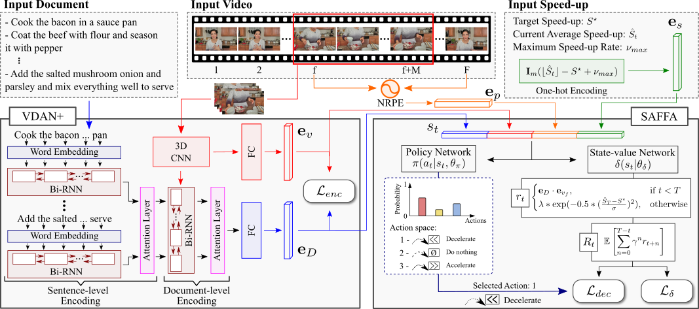

[](LICENSE)
[](https://colab.research.google.com/github/verlab/TextDrivenVideoAcceleration_TPAMI_2022/blob/main/TextDrivenVideoAcceleration_TPAMI_2022.ipynb)

<b>Text-Driven Video Acceleration: A Weakly-Supervised Reinforcement Learning Method</b>
<br>[[Project Page]](https://www.verlab.dcc.ufmg.br/semantic-hyperlapse/tpami2022) [[Paper]](https://doi.org/10.1109/TPAMI.2022.3157198) [[Video]](https://www.youtube.com/watch?v=_CfuKjdZUlE&t)
===




This repository contains the original implementation of the paper **[Text-Driven Video Acceleration: A Weakly-Supervised Reinforcement Learning Method](https://doi.org/10.1109/TPAMI.2022.3157198)**, published at the TPAMI 2022.

We present a novel weakly-supervised methodology based on a reinforcement learning formulation to accelerate instructional videos using text. A novel joint reward function guides our agent to select which frames to remove and reduce the input video to a target length without creating gaps in the final video. We also propose the Extended Visually-guided Document Attention Network (VDAN+), which can generate a highly discriminative embedding space to represent both textual and visual data.

If you find this code useful for your research, please cite the paper:

```
@ARTICLE{Ramos_2022_TPAMI,
  author={W. {Ramos} and M. {Silva} and E. {Araujo} and V. {Moura} and K. {Oliveira} L. S. {Marcolino} and E. {Nascimento}},
  journal={IEEE Transactions on Pattern Analysis and Machine Intelligence}, 
  title={Text-driven video acceleration: A weakly-supervised reinforcement learning method}, 
  year={2022},
  volume={},
  number={},
  pages={1-1},
  doi={10.1109/TPAMI.2022.3157198}}
```

---

Usage :computer:
===

Following, we describe different ways to use our code.

PyTorch Hub Model
---

  We provide [PyTorch Hub](https://pytorch.org/docs/stable/hub.html) integration.

  Loading a pretrained model and fast-forwarding your own video is pretty simple!

```python
import torch

model = torch.hub.load('verlab/TextDrivenVideoAcceleration_TPAMI_2022:main', 'TextDrivenAcceleration', pretrained=True)
model.cuda()
model.eval()

document = ['sentence_1', 'sentence_2', ..., 'sentence_N'] # Document of N sentences that will guide the agent semantically
sf = model.fast_forward_video(video_filename='video_filename.mp4',
                              document=document,
                              desired_speedup=12,
                              output_video_filename='output_filename.avi') # Returns the selected frames

print('Selected Frames: ', sf)
```


Demos
---

We provide convinient demos in CoLab.

|            **Description**     |  **Link**                     |
|--------------------------------|-------------------------------|
| Process a video using our agent | [](https://colab.research.google.com/github/verlab/TextDrivenVideoAcceleration_TPAMI_2022/blob/main/TextDrivenVideoAcceleration_TPAMI_2022.ipynb) |
| Train VDAN+ using VaTeX | [](https://colab.research.google.com/github/verlab/TextDrivenVideoAcceleration_TPAMI_2022/blob/main/demos/train_VDAN.ipynb) |
| Train the agent using YouCook2 | [](https://colab.research.google.com/github/verlab/TextDrivenVideoAcceleration_TPAMI_2022/blob/main/demos/train_SAFFA.ipynb) |
| Extract VDAN+ feats from a video | [](https://colab.research.google.com/github/verlab/TextDrivenVideoAcceleration_TPAMI_2022/blob/main/demos/extract_VDAN+_feats.ipynb) |


Data \& Code Preparation
---

If you want to download the code and run it by yourself in your environment, or reproduce our experiments, please follow the next steps:

- ### 1. Make sure you have the requirements

  - [Python](https://www.python.org/) (>=3.6)
  - [PyTorch](https://pytorch.org/) (=1.10.0) # Maybe it works with other versions

- ### 2. Clone the repo and install the dependencies

   ```bash
   git clone https://github.com/verlab/TextDrivenVideoAcceleration_TPAMI_2022.git
   cd TextDrivenVideoAcceleration_TPAMI_2022
   pip install -r requirements.txt
   ```
   
- ### 3. Prepare the data to train VDAN+

  Download \& Organize the VaTeX Dataset (Annotations and Videos) + Download the Pretrained GloVe Embeddings

    ```bash
    ## Download VaTeX JSON data
    wget -O semantic_encoding/resources/vatex_training_v1.0.json https://eric-xw.github.io/vatex-website/data/vatex_training_v1.0.json
    wget -O semantic_encoding/resources/vatex_validation_v1.0.json https://eric-xw.github.io/vatex-website/data/vatex_validation_v1.0.json

    ## Download the Pretrained GloVe Embeddings
    wget -O semantic_encoding/resources/glove.6B.zip http://nlp.stanford.edu/data/glove.6B.zip
    unzip -j semantic_encoding/resources/glove.6B.zip glove.6B.300d.txt -d semantic_encoding/resources/
    rm semantic_encoding/resources/glove.6B.zip

    ## Download VaTeX Videos (We used the kinetics-datasets-downloader tool to download the available videos from YouTube)
    # NOTE: VaTeX is composed of the VALIDATION split of the Kinetics-600 dataset; therefore, you must modify the script to download the validation videos only. 
    # We adpated the function download_test_set in the kinetics-datasets-downloader/downloader/download.py file to do so.
    # 1. Clone repository and copy the modified files
    git clone https://github.com/dancelogue/kinetics-datasets-downloader/ semantic_encoding/resources/VaTeX_downloader_files/kinetics-datasets-downloader/
    cp semantic_encoding/resources/VaTeX_downloader_files/download.py semantic_encoding/resources/VaTeX_downloader_files/kinetics-datasets-downloader/downloader/download.py
    cp semantic_encoding/resources/VaTeX_downloader_files/config.py semantic_encoding/resources/VaTeX_downloader_files/kinetics-datasets-downloader/downloader/lib/config.py

    # 2. Get the kinetics dataset annotations
    wget -O semantic_encoding/resources/VaTeX_downloader_files/kinetics600.tar.gz https://storage.googleapis.com/deepmind-media/Datasets/kinetics600.tar.gz
    tar -xf semantic_encoding/resources/VaTeX_downloader_files/kinetics600.tar.gz -C semantic_encoding/resources/VaTeX_downloader_files/
    rm semantic_encoding/resources/VaTeX_downloader_files/kinetics600.tar.gz

    # 3. Download the videos (This can take a while (~28k videos to download)... If you want, you can stop it at any time and train with the downloaded videos)
    python3 semantic_encoding/resources/VaTeX_downloader_files/kinetics-datasets-downloader/downloader/download.py --val

    # Troubleshooting: If the download stops for a long time, experiment increasing the queue size in the parallel downloader (semantic_encoding/resources/VaTeX_downloader_files/kinetics-datasets-downloader/downloader/lib/parallel_download.py)
    ```

  If you want just to train VDAN+, you're now set!

- ### 4. Prepare the data to train the Skip-Aware Fast-Forward Agent (SAFFA) 

  Download \& Organize the [YouCook2 Dataset](http://youcook2.eecs.umich.edu/) (Annotations and Videos)

    ```bash
    # Download and extract the annotations
    wget -O rl_fast_forward/resources/YouCook2/youcookii_annotations_trainval.tar.gz http://youcook2.eecs.umich.edu/static/YouCookII/youcookii_annotations_trainval.tar.gz
    tar -xf rl_fast_forward/resources/YouCook2/youcookii_annotations_trainval.tar.gz -C rl_fast_forward/resources/YouCook2/
    rm rl_fast_forward/resources/YouCook2/youcookii_annotations_trainval.tar.gz
    
    # Download the scripts used to collect the videos
    wget -O rl_fast_forward/resources/YouCook2/scripts.tar.gz http://youcook2.eecs.umich.edu/static/YouCookII/scripts.tar.gz
    tar -xf rl_fast_forward/resources/YouCook2/scripts.tar.gz -C rl_fast_forward/resources/YouCook2/
    rm rl_fast_forward/resources/YouCook2/scripts.tar.gz

    # Install youtube-dl and download the available videos
    pip install youtube_dl
    cd rl_fast_forward/resources/YouCook2/scripts
    python download_youcookii_videos.py
    ```


Training :hourglass_flowing_sand:
---

After running the setup above, you're ready to train the networks.

### Training VDAN+
  
To train VDAN+, you first need to set up the model and train parameters (current parameters are the same as described in the paper) in the [semantic_encoding/config.py](semantic_encoding/config.py) file, then run the training script [semantic_encoding/train.py](semantic_encoding/train.py).

The training script will save the model in the [semantic_encoding/models](semantic_encoding/models) folder.

  - ### 1. Setup

    ```python
    model_params = {
        'num_input_frames': 32,
        'word_embed_size': 300,
        'sent_embed_size': 512,  # h_ij
        'doc_embed_size': 512,  # h_i
        'hidden_feat_size': 512,
        'feat_embed_size': 128,  # d = 128. We also tested with 512 and 1024, but no substantial changes
        'sent_rnn_layers': 1,  # Not used in our paper, but feel free to change
        'word_rnn_layers': 1,  # Not used in our paper, but feel free to change
        'word_att_size': 1024,  # c_p
        'sent_att_size': 1024,  # c_d

        'use_sentence_level_attention': True,  # Not used in our paper, but feel free to change
        'use_word_level_attention': True,  # Not used in our paper, but feel free to change
        'use_visual_shortcut': True,  # Uses the R(2+1)D output as the first hidden state (h_0) of the document embedder Bi-GRU.
        'learn_first_hidden_vector': False  # Learns the first hidden state (h_0) of the document embedder Bi-GRU.
    }

    ETA_MARGIN = 0.  # η from Equation 1 - (Section 3.1.3 Training)

    train_params = {
        # VaTeX
        'captions_train_fname': 'resources/vatex_training_v1.0.json', # Run semantic_encoding/resources/download_resources.sh first to obtain this file
        'captions_val_fname': 'resources/vatex_validation_v1.0.json', # Run semantic_encoding/resources/download_resources.sh first to obtain this file
        'train_data_path': 'datasets/VaTeX/raw_videos/', # Download all Kinetics-600 (10-seconds) validation videos using the semantic_encoding/resources/download_vatex_videos.sh script
        'val_data_path': 'datasets/VaTeX/raw_videos/', # Download all Kinetics-600 (10-seconds) validation videos using the semantic_encoding/resources/download_vatex_videos.sh script

        'embeddings_filename': 'resources/glove.6B.300d.txt', # Run semantic_encoding/resources/download_resources.sh first to obtain this file

        'max_sents': 20,  # maximum number of sentences per document
        'max_words': 20,  # maximum number of words per sentence

        # Training parameters
        'train_batch_size': 64, # We used a batch size of 64 (requires a 24Gb GPU card)
        'val_batch_size': 64, # We used a batch size of 64 (requires a 24Gb GPU card)
        'num_epochs': 100, # We ran in 100 epochs
        'learning_rate': 1e-5,
        'model_checkpoint_filename': None,  # Add an already trained model to continue training (Leave it as None to train from scratch)...

        # Video transformation parameters
        'resize_size': (128, 171),  # h, w
        'random_crop_size': (112, 112),  # h, w
        'do_random_horizontal_flip': True,  # Horizontally flip the whole video randomly in block

        # Training process
        'optimizer': 'Adam',
        'eta_margin': ETA_MARGIN,
        'criterion': nn.CosineEmbeddingLoss(ETA_MARGIN),

        # Machine and user data
        'username': getpass.getuser(),
        'hostname': socket.gethostname(),

        # Logging parameters
        'checkpoint_folder': 'models/',
        'log_folder': 'logs/',

        # Debugging helpers (speeding things up for debugging)
        'use_random_word_embeddings': False,  # Choose if you want to use random embeddings
        'train_data_proportion': 1.,  # Choose how much data you want to use for training
        'val_data_proportion': 1.,  # Choose how much data you want to use for validation
    }

    models_paths = {
        'VDAN': '<PATH/TO/THE/VDAN/MODEL>', # OPTIONAL: Provide the path to the VDAN model (https://github.com/verlab/StraightToThePoint_CVPR_2020/releases/download/v1.0.0/vdan_pretrained_model.pth) from the CVPR paper: https://github.com/verlab/StraightToThePoint_CVPR_2020/
        'VDAN+': '<PATH/TO/THE/VDAN+/MODEL>' # You must fill this path after training the VDAN+ to train the SAFFA agent
    }

    deep_feats_base_folder = '<PATH/TO/THE/VDAN+EXTRACTED_FEATS/FOLDER>' # Provide the location you stored/want to store your VDAN+ extracted feature vectors
    ```

  - ### 2. Train

    First, make sure you have `punkt` installed...

    ```python
    import nltk
    nltk.download('punkt')
    ```

    Finally, you're ready to go! :smiley:

    ```bash
    cd semantic_encoding
    python train.py
    ```

### Training the Skip-Aware Fast-Forward Agent (SAFFA)

  - To train the agent, you will need the features produced the VDAN+ model. You can have these features [here](http://verlab.dcc.ufmg.br/TextDrivenVideoAcceleration/youcook2_vdan+_vid_feats.zip) and [here](https://verlab.dcc.ufmg.br/TextDrivenVideoAcceleration/youcook2_vdan+_doc_feats.zip). To get it via terminal, use:

    ```bash
    # Download YouCook2's VDAN+ video feats
    wget -O resources/YouCook2/VDAN+/youcook2_vdan+_vid_feats.zip https://verlab.dcc.ufmg.br/TextDrivenVideoAcceleration/youcook2_vdan+_vid_feats.zip
    unzip -q resources/YouCook2/VDAN+/youcook2_vdan+_vid_feats.zip -d resources/YouCook2/VDAN+/vid_feats/
    rm resources/YouCook2/VDAN+/youcook2_vdan+_vid_feats.zip
    
    # Download YouCook2's VDAN+ document feats
    wget -O resources/YouCook2/VDAN+/youcook2_vdan+_doc_feats.zip https://verlab.dcc.ufmg.br/TextDrivenVideoAcceleration/youcook2_vdan+_doc_feats.zip
    unzip -q resources/YouCook2/VDAN+/youcook2_vdan+_doc_feats.zip -d resources/YouCook2/VDAN+/doc_feats/
    rm resources/YouCook2/VDAN+/youcook2_vdan+_doc_feats.zip
    ```
  
  - If you want to extract them by yourself, you can have a VDAN+ pretrained model by following the instructions in the previous step or downloading a pretrained one we provide [here](https://github.com/verlab/TextDrivenVideoAcceleration_TPAMI_2022/releases/download/pre_release/vdan+_pretrained_model.pth). In terminal, use: 

    ```bash
    # Download the pretrained model
    wget -O semantic_encoding/models/vdan+_model_pretrained.pth https://github.com/verlab/TextDrivenVideoAcceleration_TPAMI_2022/releases/download/pre_release/vdan+_pretrained_model.pth
    ```

  - Now, prepare the data for training...

    ```bash
    cd rl_fast_forward
    python resources/create_youcook2_recipe_documents.py
    ```
  
  - You are set! Now, you just need to run it...

    ```bash
    python train.py -s ../semantic_encoding/models/vdan+_model_pretrained.pth -d YouCook2
    ```

  - After training, the model will be saved in the [rl_fast_forward/models](rl_fast_forward/models) folder.

Inference
---

  - You can test the agent using a [saved model](https://github.com/verlab/TextDrivenVideoAcceleration_TPAMI_2022/releases/download/pre_release/youcookii_saffa_model.pth) for the YouCook2 dataset as follows:

    ```bash
    python test.py -s ../semantic_encoding/models/vdan+_model_pretrained.pth -m models/saffa_vdan+_model.pth -d YouCook2 -x 12
    ```
    
  - This script will generate a results JSON file with the pattern `results/<datetime>_<hostname>_youcookii_selected_frames.json`

Evaluating
---

  We provide, in the [rl_fast_forward/eval](rl_fast_forward/eval) folder, a script to evaluate the selected frames generated by the trained agent.

  - To compute Precision, Recall, F1 Score, and Output Speed for your results using the JSON output (generated when training the agent), run the following script:

    ```bash
    cd rl_fast_forward/eval
    python eval_results.py -gt youcookii_gts.json -sf /path/to/the/JSON/output/file.json
    ```

  - You may need to download the ground-truth file first:
  
    ```bash
    cd rl_fast_forward/eval
    
    # For the YouCook2 dataset
    wget https://verlab.dcc.ufmg.br/TextDrivenVideoAcceleration/youcookii_gts.json
    
    # For the COIN dataset
    wget https://verlab.dcc.ufmg.br/TextDrivenVideoAcceleration/coin_gts.json
    ```

  - It will display the values in your screen and generate a JSON and a CSV output file formatted as: `/path/to/the/JSON/output/file_results.EXT`

  - If you want to reproduce our results, we also provide the selected frames for the compared approaches [here](https://verlab.dcc.ufmg.br/TextDrivenVideoAcceleration/results.zip). It can be downloaded by running:
  
    ```bash    
    wget https://verlab.dcc.ufmg.br/TextDrivenVideoAcceleration/results.zip
    unzip -q results.zip
    rm results.zip    
    ```

---


Contact
===

Authors
---

* Washington Ramos - PhD Candidate - UFMG - washington.ramos@dcc.ufmg.br
* Michel Silva - Assistant Professor at Universidade Federal de Viçosa (UFV) - michelms@dcc.ufmg.br
* Edson Araujo - MSc Student - UFMG - edsonroteia@dcc.ufmg.br
* Victor Moura - Undergraduate Student - UFMG - victorhugomoura@dcc.ufmg.br
* Keller Oliveira - Undergraduate Student - UFMG - kellermartins@dcc.ufmg.br
* Leandro Soriano Marcolino - Lecturer at Lancaster University - l.marcolino@lancaster.ac.uk
* Erickson R. do Nascimento - Principal Investigator - UFMG - erickson@dcc.ufmg.br

Institution
---

Universidade Federal de Minas Gerais (UFMG)  
Departamento de Ciência da Computação  
Belo Horizonte - Minas Gerais - Brazil 

Laboratory
---

 | 
--- | ---

**VeRLab:** Laboratory of Computer Vison and Robotics   
https://www.verlab.dcc.ufmg.br

---

Acknowledgements
===

We thank the agencies CAPES, CNPq, FAPEMIG, and Petrobras for funding different parts of this work.

### Enjoy it! :smiley: